# netMusic音乐播放器

## 1、效果展示

> netMusic播放器需要手机支持Nreal投屏即可，在项目unpackage下，提供了体验版本，详情见使用说明

本音乐播放器需要配合Nreal眼镜使用，在Nreal眼镜中的效果大致如下图所示

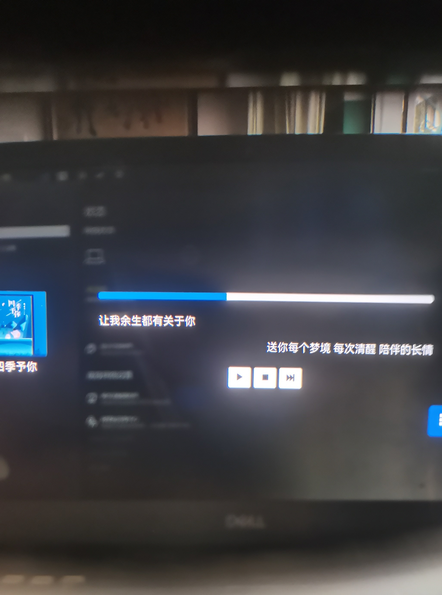

可以让你在日常走路或其它场景下，佩戴Nreal眼镜的过程中听歌的同时也能够看到歌词。

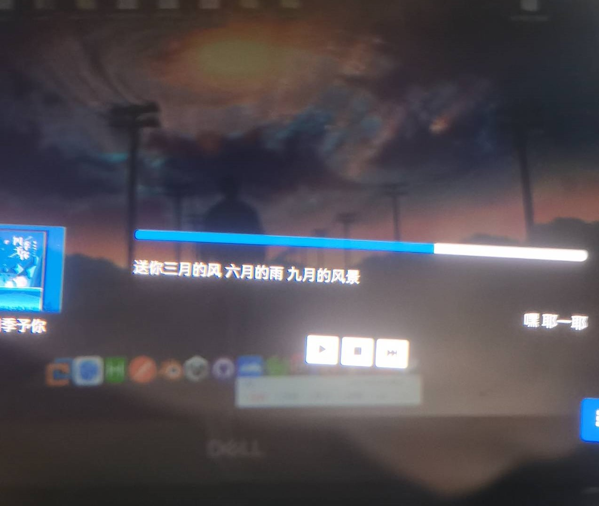

这是用手机实拍的效果图，可能不够清晰，具体效果可以自己尝试安装。

netMusic提供的播放功能是从网易云音乐开放API中获取到的我的歌单或是推荐的歌单中播放，因此您需要登录您的网易云音乐账号。

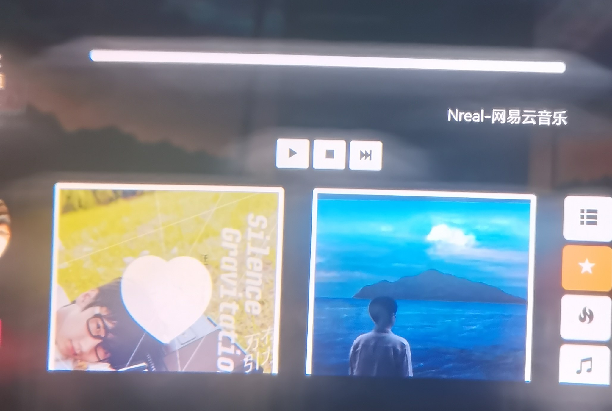

在登录后会获取您的账号中的喜欢歌单，单击歌单图片即可随机播放其中的所有歌曲。

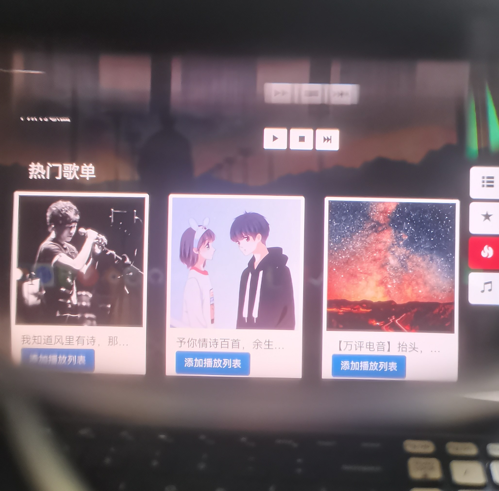

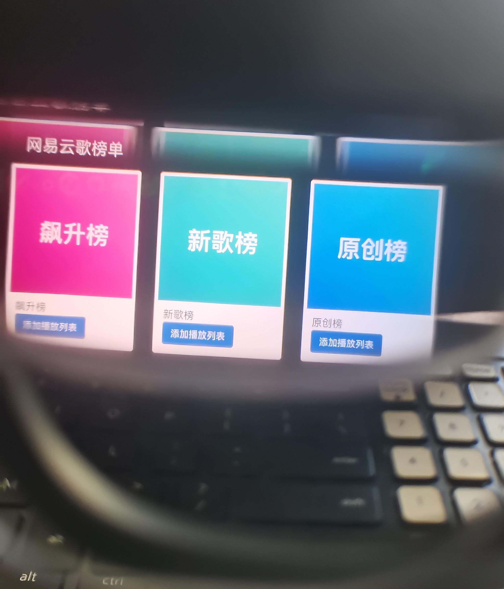


## 2、安装说明

本播放器的安装通过node.js安装网易云音乐API

`API` 由 [Binaryify/NeteaseCloudMusicApi](https://github.com/Binaryify/NeteaseCloudMusicApi) 提供。

将上述文件克隆到本地后

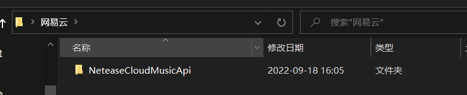

npm install后通过终端运行

```
node.js
```

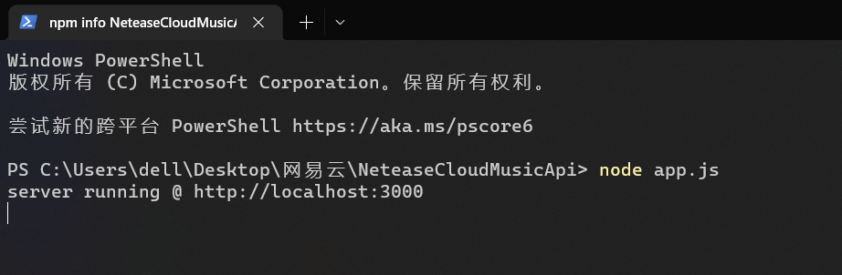

将文件夹下的js/api.js中的config.baseurl修改为当前的服务地址

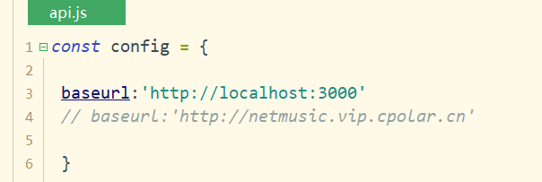

注：http://netmusic.vip.cpolar.cn 为我本人使用cpolar创建的隧道，有时会断，供体验，真正日常使用还请部署到自己的服务器。

完成配置后您有多种方式可以通过Nreal眼镜打开，比如

- 可以通过打包本项目为apk安装包，直接安装在手机上，通过Nreal眼镜的投屏功能打开

  > 通过Hbuilderx中的的发行-原生APP-云打包，（可以直接打包，无需其它设置）

  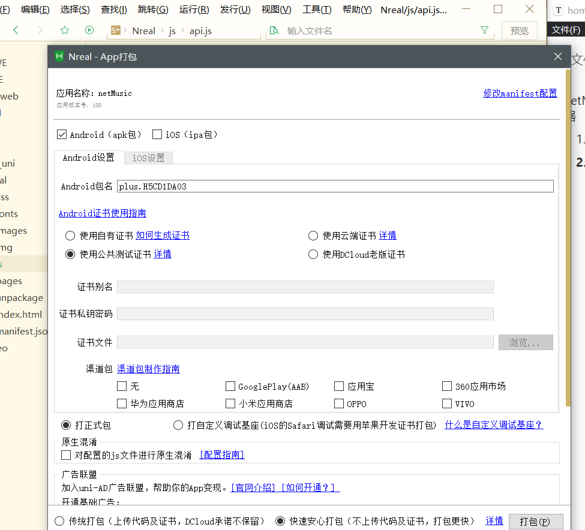

- 可以通过将本项目部署到tomcat等web服务器，通过在手机浏览器访问index.html页面

- 也可以直接在电脑上打开index都可以看到效果


## 3、使用说明

在项目的`unpackage`-`release`-`apk`目录下提供了体验版本

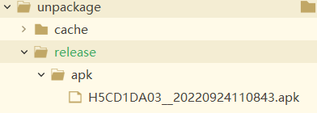

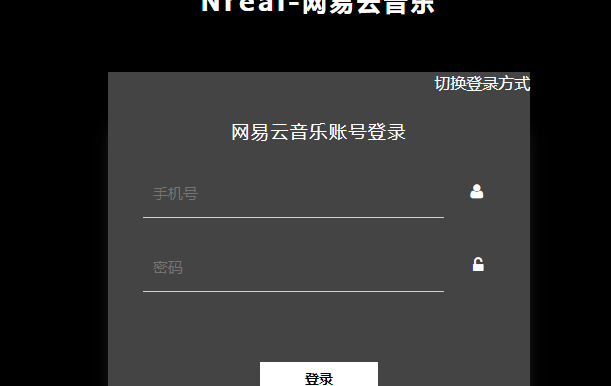

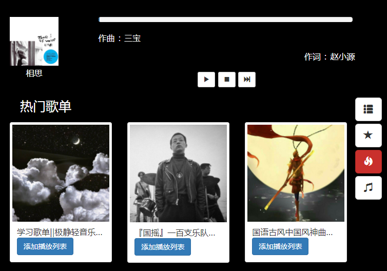

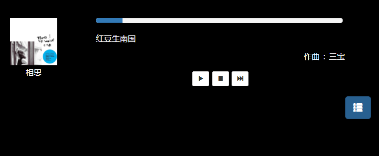

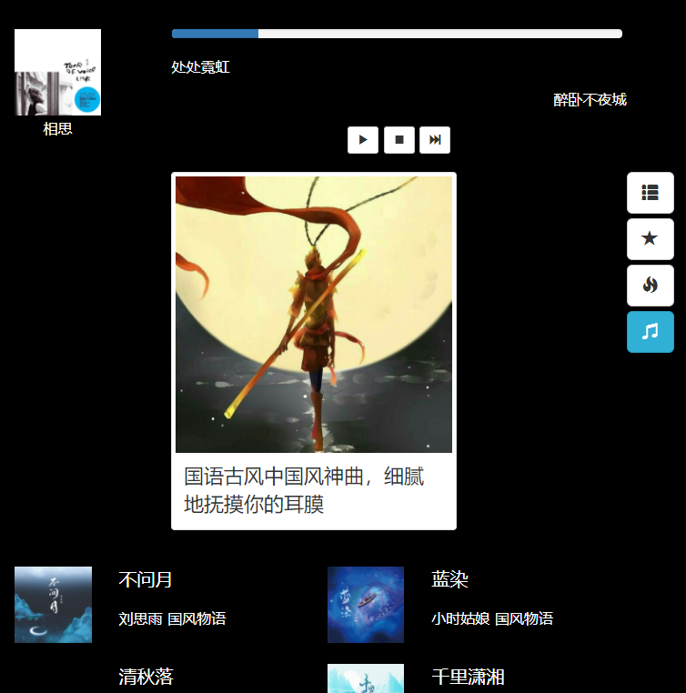


